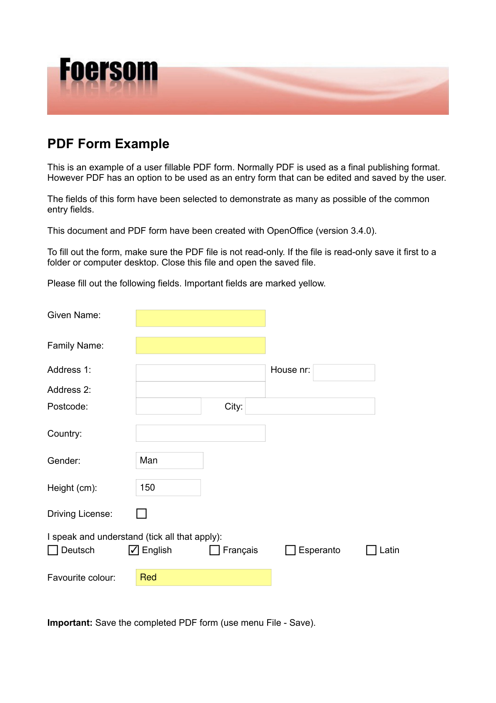
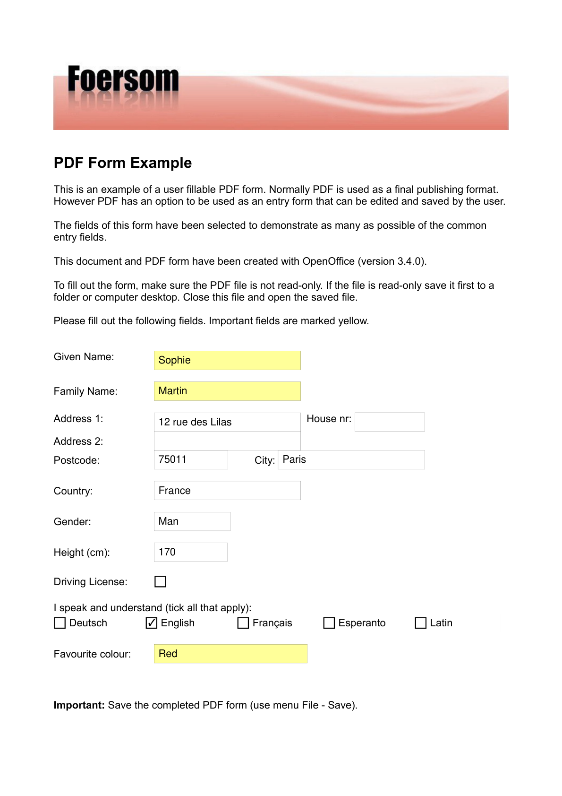
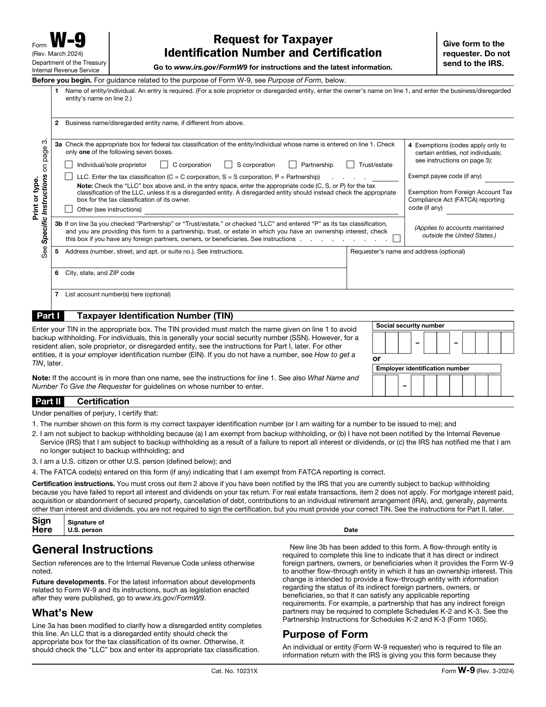
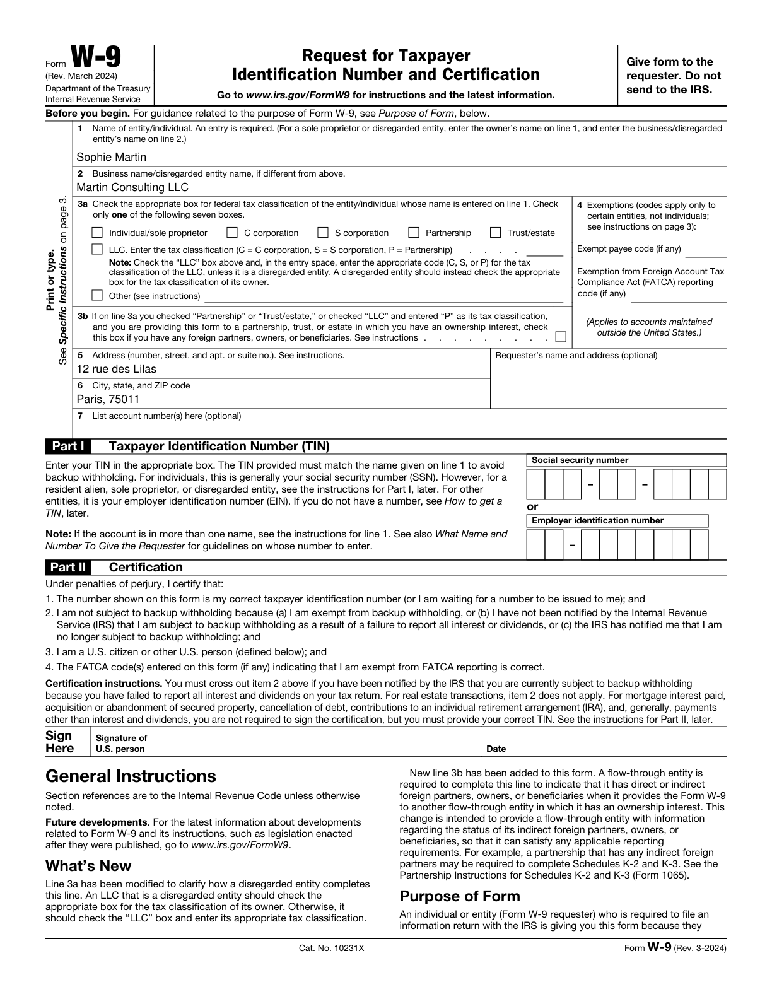

<p align="center">
  
</p>

<h1 align="center">Plume</h1>

<p align="center">
  <strong>Fill any PDF form with a single command. Interactive fields, graphical forms, any language.</strong>
</p>

<p align="center">
  A <a href="https://docs.anthropic.com/en/docs/claude-code">Claude Code</a> skill that reads your PDF, figures out the fields, fills them in, and verifies its own work.
</p>

<p align="center">
  <a href="#installation">Install</a> &bull;
  <a href="#usage">Usage</a> &bull;
  <a href="#how-it-works">How it works</a> &bull;
  <a href="#testing">Tests</a> &bull;
  <a href="#license">License</a>
</p>

---

## See it in action

<table>
<tr>
<td align="center"><strong>Before</strong></td>
<td align="center"><strong>After <code>/plume</code></strong></td>
</tr>
<tr>
<td></td>
<td></td>
</tr>
<tr><td colspan="2" align="center"><em>AcroForm PDF &mdash; text fields, checkboxes, and dropdowns filled directly</em></td></tr>
</table>

<table>
<tr>
<td align="center"><strong>Before</strong></td>
<td align="center"><strong>After <code>/plume</code></strong></td>
</tr>
<tr>
<td></td>
<td></td>
</tr>
<tr><td colspan="2" align="center"><em>IRS W-9 &mdash; tax form with nested XFA fields</em></td></tr>
</table>

<table>
<tr>
<td align="center"><strong>Before</strong></td>
<td align="center"><strong>After <code>/plume</code></strong></td>
</tr>
<tr>
<td></td>
<td></td>
</tr>
<tr><td colspan="2" align="center"><em>Schengen visa application &mdash; graphical PDF with no interactive fields, filled via precise text overlay</em></td></tr>
</table>

---

## Installation

**1. Clone the repo:**

```bash
git clone https://github.com/gi11es/plume.git
cd plume
```

**2. Install dependencies:**

```bash
pip install -r requirements.txt
```

**3. Link the skill to Claude Code:**

```bash
mkdir -p ~/.claude/skills
ln -s "$(pwd)/.claude/skills/plume" ~/.claude/skills/plume
```

That's it. `/plume` is now available from any directory.

## Usage

```
/plume ~/Downloads/some-form.pdf
```

Plume will:

1. **Analyze** the PDF &mdash; detect whether it has interactive fields (AcroForm) or is a graphical form
2. **Show you** the fields it found and what it plans to fill
3. **Remember** your info from previous sessions &mdash; only ask for what's missing
4. **Fill** the form using the right strategy (direct field values or text overlay)
5. **Verify** the output visually and programmatically, self-correcting up to 3 times
6. **Save** your new info for next time

### What it handles

| PDF type | How Plume fills it |
|----------|-------------------|
| **Interactive forms** (AcroForm) | Sets field values directly &mdash; text, checkboxes, dropdowns |
| **Graphical forms** (no fields) | Reads the content stream, finds colored rectangles and labels, overlays text at exact coordinates |
| **Mixed** | Both strategies combined |

Tested on government forms from the US (IRS), UK (HMCTS), Germany, Spain, France, Canada, and the EU &mdash; in English, French, Spanish, and German.

## How it works

```
PDF in --> Extract structure --> Map fields --> Fill --> Verify --> PDF out
               |                    |                     |
               v                    v                     v
          Content stream      Load memory           Visual check
          + AcroForm          Ask for missing       + coordinate check
          field detection     Save new data         (self-correction loop)
```

Three Python scripts do the heavy lifting:

| Script | What it does |
|--------|-------------|
| `scripts/extract.py` | Parses PDF content streams for text labels, colored rectangles, and checkboxes. Detects AcroForm fields with types, options, and positions. |
| `scripts/fill.py` | Fills forms via AcroForm field values or reportlab text overlay merged onto the original. |
| `scripts/verify.py` | Checks that filled text lands inside target field bounds. Returns a pass/fail JSON report. |

### Memory

Plume remembers your info between sessions in `memory/user-info.json`. On first run, copy the example:

```bash
cp memory/user-info.example.json memory/user-info.json
```

Then fill it with your details (or let Plume ask you interactively &mdash; it will save automatically).

## Project structure

```
plume/
├── scripts/
│   ├── extract.py          # PDF structure parser
│   ├── fill.py             # Form filler (overlay + AcroForm)
│   └── verify.py           # Fill verification
├── memory/
│   ├── user-info.example.json  # Example data (committed)
│   └── user-info.json          # Your real data (gitignored)
├── tests/
│   ├── fixtures/           # 12 government PDF forms
│   ├── test_extract.py
│   ├── test_fill.py
│   └── test_verify.py
├── assets/                 # Logo + demo screenshots
├── .claude/
│   └── skills/plume/       # Claude Code skill definition
├── requirements.txt
└── pyproject.toml
```

## Testing

```bash
pip install pytest
pytest tests/ -v
```

The test suite runs against 12 real-world PDF forms:

| Form | Type | Language | Fields |
|------|------|----------|--------|
| US W-9 (IRS) | AcroForm | English | 23 |
| US W-4 (IRS) | AcroForm | English | 48 |
| US I-9 (USCIS) | AcroForm | English | 128 |
| US SF-86 (OPM) | AcroForm | English | 6,197 |
| UK N285 (HMCTS) | AcroForm | English | 8 |
| German Kindergeld | AcroForm | German/English | 95 |
| Spanish Modelo 030 | AcroForm | Spanish | 84 |
| Foersom sample | AcroForm | English | 17 |
| Canadian TD1 | Graphical | English | &mdash; |
| EU Schengen visa | Graphical | English | &mdash; |
| French Schengen visa | Graphical | French | &mdash; |
| German Schengen visa | Graphical | German/English | &mdash; |

## License

[MIT](LICENSE)
